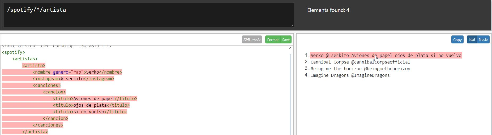

# APUNTES M4 #

1. MINIDOM
   * ¿Qué es?
   * Propiedades
   * Acceder a nodos
   * Propiedades de los nodos
   * Lista de nodos
2. XPATH
   * ¿Qué es?
   * Selección de nodos
   * Ejemplos de XPATH
3. XSLT
   * ¿Qué es?
   * < xsl:template >
   * < xsl:value-of >
   * <xsl: for-each >
   * < xsl:sort >
   * < xsl:choose > / < xsl:when > / < xsl:otherwise >


## Minidom ##
_¿Qué es?_

DOM es un modelo de manipulación de objetos de un documento que te permite acceder al contenido de un documento teniendo en cuenta una estructura de _arbol_. DOM te permite *acceder, cambiar, añadir o borrar* elementos del documento.

### Propiedades
1. x.nodeName --> Nombre de X
2. x.nodeValue --> Valor de X
3. x.getElementsByTagName("name)--> Saca todos los elementos que se llamen como el nombre que se ha especificado. 

### Acceder a nodos
Se puede acceder a todos los nodos del documento usando las relaciones del árbol de nodos o usando *getElementsByTagName()*.

>nodo.getElementsByTagname("titulo") 
> Devolverá todos los elementos <titulo> que haya dentro del nodo 'nodo'
---
 Se puede crear una lista guardando la lista que getElementsByTagName() te devuelve en una variable, a la que puedes acceder mas tarde mediante índices.

### Propiedades de los nodos

Cada nodo es un objeto que cuenta con propiedades como:
* NodeName: Especifica el nombre de un nodo y es una propiedad read only. El NodeName es, grosso modo, la etiqueta, y si hablamos de un nodo de texto, siempre será texto. 
* NodeValue: Especifica el valor de un nodo. Para los nodos elemento está indefinido mientras que para los nodos de texto es el propio texto.
* NodeType: Especifica el tipo de nodo, por ejemplo, _elemento, atributo, texto, comentario o documento_

### Lista de nodos
Cuando usas propiedades como *childnodes* o *getElementsByTagName* obtienes una lista de nodos, ordenada como está en el xml. Al ser una lista puedes acceder a ella mediante índices.  

## XPATH
_¿Qué es?_

XPATH es un elemento básico del estándar xsl, en el cual encontramos nodos que se relacionan entre sí. Tenemos varios tipos de nodo, como pueden ser *elementos*, *atributos* o *texto*. Entre ellos también se encuentra el nodo raiz. 

Todos los elementos y atributos tienen un elemento padre, que  a su vez puede tener varios hijos. Cuando dos o más nodos comparten elemento padre decimos que son _hermanos_.

### Selección de nodos

Dentro del arbol de nodos hay atajos para acceder a determinados nodos.

> * NombreNodo ---> Devuelve todos los hijos del nodo
> * / ------> Raiz
> * // -----> Todos los nodos del documento
> * . ------> Nodo actual
> * .. -----> Padre del nodo
> * @ ---> Atributo


### Ejemplos de XPATH

```angular2html
<?xml-stylesheet type="text/xsl" href="Prueba.xsl"?>
<spotify>
    <artistas>
        <artista>
            <nombre genero="rap">Serko</nombre>
            <instagram>@_serkito</instagram>
            <canciones>
                <cancion>
                    <titulo>Aviones de papel</titulo>
                    <titulo>ojos de plata</titulo>
                    <titulo>si no vuelvo</titulo>
                </cancion>
            </canciones>
        </artista>
        <artista>
            <nombre genero="rumba catalana">estopa</nombre>
            <instagram>@estopa</instagram>
            <canciones>
                <cancion>tu calorro</cancion>
                <cancion>jardin del olvido</cancion>
                <cancion>luna lunera</cancion>
            </canciones>
        </artista>
        <artista>
            <nombre genero="heavy metal">Bring me the horizon</nombre>
            <instagram>@bringmethehorizon</instagram>
            <canciones>
                <cancion>LosT</cancion>
                <cancion>go to hell for heavens sake</cancion>
                <cancion>vampir</cancion>
            </canciones>
        </artista>
        <artista>
            <nombre genero="pop rock">Imagine Dragons</nombre>
            <instagram>@ImagineDragons</instagram>
            <canciones>
                <cancion>tip toe</cancion>
                <cancion>warriors</cancion>
                <cancion>demons</cancion>
            </canciones>
        </artista>
    </artistas>
</spotify>
```

> Si queremos obtener el cuarto artista del XML

> Si queremos obtener el texto de las etiquetas nombre que tengan un atributo _"genero"_
>

>Si queremos obtener el nombre de todos los nodos con un atributo concreto


>Si queremos obtener todas las etiquetas.

 
 
>Si queremos obtener el nombre de todos los artistas que tengan un atributo

 
 
>Obtener todos los datos de los artistas cuyo instagram sea uno concreto


 
> Obtener el texto concreto de una etiqueta.


## XSLT
_¿Qué es?_

XSLT es una hoja de estilos para XML, al igual que CSS lo sería para HTML. XSLT transforma un documento XML en un documento HTML recurriendo a rutas xpath para seleccionar los elementos que queremos añadir a nuestro documento recién creado.

Antes que nada, debemos especificar la cabecera del XSL, en la que declaramos la versión del XSL y despues abrimos la etiqueta <_xsl:stylesheet_>, que envolverá el documento completo.
````angular2html
<xsl:stylesheet version="1.0" xmlns:xsl="http://www.w3.org/1999/XSL/Transform">
    <xsl:output method="html" indent="yes"/>
</xsl:stylesheet>
   ````

En el documento XML tienes que referenciar al XSL. 
````angular2html
<?xml-stylesheet type="text/xsl" href="Prueba.xsl"?>
````
### < xsl:template > 
Se usa para crear plantillas. El atributo _match_ se usa para asociar una plantilla a una parte del documento recurriendo a rutas XPATH. Podemos aplicar una plantilla a cada parte del documento en base a la expresión XPATH que pongamos. 

### < xsl:value-of >
Lo puedes usar para extraer el valor de un nodo, pudiendo añadir este mismo al nuevo documento HTML que estás creando. Es decir, puedes abrir una etiqueta HTML como puede ser ```<p></p>``` y dentro de la misma escribir ```<xsl:value-of select="XPATH"/>```.

### < xsl:for-each >
Con esta etiqueta podemos crear bucles dentro de nuestro propio documento XSL. Con ````<xsl:for-each >```` puedes seleccionar todos los elementos XML de un conjunto de nodos. Es decir, tienes varias etiquetas ```<cancion></cancion>``` dentro de la etiqueta ```<album></album>```, puedes recorrer cada una de las etiquetas que se encuentran en "album" con un for-each.

### < xsl:sort >
Esta etiqueta nos servirá para ordenar en manera alfabética los resultados de nuestro ````<xsl:for-each >````. Simplemente lo pondremos justo después del bucle. 

### < xsl:choose > / < xsl:when > / < xsl:otherwise >
Se utiliza para obtener una condición múltiple. 

````angular2html
<xsl:choose>
<xsl:when test="price &gt; 10">
<td bgcolor="#ff00ff">
<xsl:value-of select="artist"/></td>
</xsl:when>
<xsl:otherwise>
<td><xsl:value-of select="artist"/></td>
</xsl:otherwise>
</xsl:choose>
````
El choose te hace elegir entre unas opciones que facilitas en el when, y si no es la opción conrrecta salta al otherwise. Seria como hacer un If/elif/else en python. 


### Mas enlaces de interés

> + [Documentación DOM](https://docs.python.org/3/library/xml.dom.minidom.html#xml.dom.minidom.Node.toxml)
> + [Tutorial XSL](https://www.google.com/url?sa=t&rct=j&q=&esrc=s&source=web&cd=&cad=rja&uact=8&ved=2ahUKEwiewLmL36mFAxW27bsIHVblAqEQwqsBegQIDxAG&url=https%3A%2F%2Fwww.youtube.com%2Fwatch%3Fv%3DW--Yhp0m35A&usg=AOvVaw27ZcUga0r1n451Os0vrK1x&opi=89978449)
> + [Comrpobador XPATH online](http://xpather.com)
> + [Guía sobre MarkDown](https://tutorialmarkdown.com/guia)
